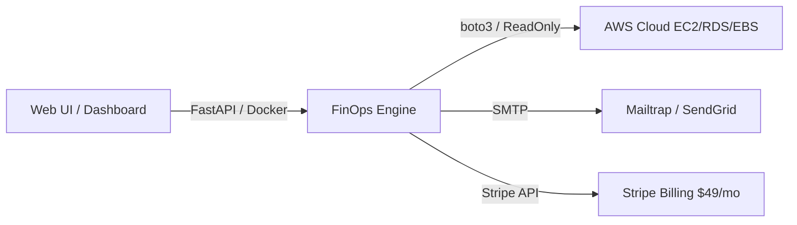

# ⚡ AWS Cloud FinOps Auto-Scaler & Idle Resource Scanner

[](https://cloud-finops-scanner.onrender.com/)
[](https://github.com/Bhupendrasirvi/cloud-finops-scanner)

A production-ready Cloud FinOps SaaS tool that automatically detects wasted AWS spend (idle EC2 instances, unattached EBS volumes, idle RDS databases, and unassociated Elastic IPs) and provides **1-click Sleep Mode** automation to eliminate 20%–40% of monthly cloud infrastructure budgets.

---

## 🌐 Live Application
- **Production Dashboard:** [https://cloud-finops-scanner.onrender.com/](https://cloud-finops-scanner.onrender.com/)
- **Demo Mode:** Click **🧪 Demo Scan** on the live link to test without entering AWS credentials.

---

## 🏗️ System Architecture



---

## ✨ Key Features

- 🔍 **AWS Waste Detection:** 
  - **Unattached EBS Volumes:** Identifies unattached `gp2`/`gp3` disks and calculates monthly wasted storage spend.
  - **Unassociated Elastic IPs:** Finds idle public IPs ($3.60/mo each).
  - **Idle EC2 Instances:** Analyzes CloudWatch CPU metrics over 7 days (<5% average CPU).
  - **Idle RDS Databases:** Scans CloudWatch metrics over 7 days for databases with 0 active connections.
- 😴 **1-Click Sleep Mode:** Stop idle EC2 instances and RDS databases directly from the dashboard via `boto3` calls, recording real-time monthly savings.
- 🔐 **Zero-Friction & Secure Auth:** 
  - In-memory session management with **60-minute automatic credential TTL**.
  - Guidance and support for read-only IAM policies & STS `AssumeRole` cross-account scanning.
- 📧 **Automated ROI Email Reports:** Sends dark-mode HTML email executive summaries of wasted spend to stakeholders via SMTP.
- 💳 **Stripe Billing Integration:** Includes built-in support for `$49/month` Pro Tier subscription checkout flow.
- 🐳 **Docker & Cloud Native:** Fully containerized with non-root security principles and deployed on Render.

---

## 🚀 Quickstart (Local Development)

### 1. Clone & Install
```bash
git clone https://github.com/Bhupendrasirvi/cloud-finops-scanner.git
cd cloud-finops-scanner
pip install -r requirements.txt
```

### 2. Configure Environment (Optional)
Copy `.env.example` to `.env` if you want local SMTP email or Stripe testing:
```bash
cp .env.example .env
```

### 3. Start Dashboard Server
```bash
python main.py
```
Open **[http://localhost:8000](http://localhost:8000)** in your browser.

---

## 📄 Resume Bullet Points

If you built or contributed to this project, here is a polished resume entry:

> **Cloud FinOps Auto-Scaler** | *Python, FastAPI, AWS SDK (boto3), Docker, TailwindCSS, Stripe, Render*
> - Built a full-stack Cloud FinOps SaaS tool detecting idle AWS resources (EC2, RDS, EBS, EIP) saving users 20%–40% on monthly cloud spend.
> - Implemented 1-click **Sleep Mode** automation using `boto3` `stop_instances` & `stop_db_instance` with live savings tracking.
> - Engineered secure session credential handling with 60-min TTL, read-only IAM policy enforcement, and Dockerized deployment.
> - Integrated automated HTML ROI email reporting via SMTP and a Stripe Checkout subscription flow ($49/month).

---

## 🛠️ Project Structure

- [`main.py`](file:///C:/Users/bhupendra_sirvi/.gemini/antigravity/scratch/cloud-finops-scanner/main.py): FastAPI backend, API endpoints (Scan, Sleep, Email, Stripe Checkout).
- [`aws_waste_scanner.py`](file:///C:/Users/bhupendra_sirvi/.gemini/antigravity/scratch/cloud-finops-scanner/aws_waste_scanner.py): Core AWS waste detection engine using `boto3`.
- [`dashboard.html`](file:///C:/Users/bhupendra_sirvi/.gemini/antigravity/scratch/cloud-finops-scanner/dashboard.html): Single-Page Dashboard built with Vanilla JS, TailwindCSS & Chart.js.
- [`Dockerfile`](file:///C:/Users/bhupendra_sirvi/.gemini/antigravity/scratch/cloud-finops-scanner/Dockerfile): Production Docker container definition.
- [`template.yaml`](file:///C:/Users/bhupendra_sirvi/.gemini/antigravity/scratch/cloud-finops-scanner/template.yaml): AWS CloudFormation template for 1-click cross-account IAM role connection.
